# Mindful Vibes

Mindful Vibes is a wellness blog focused on mental health, balance, and stress management. It provides a space for users to read articles on various wellness topics and interact by commenting on posts. The blog aims to foster a supportive community where users can engage in meaningful discussions about mental well-being.

## Live Site

A live version of the site can be found [here](https://mindful-vibes-4dd2a43e1ec5.herokuapp.com/)  
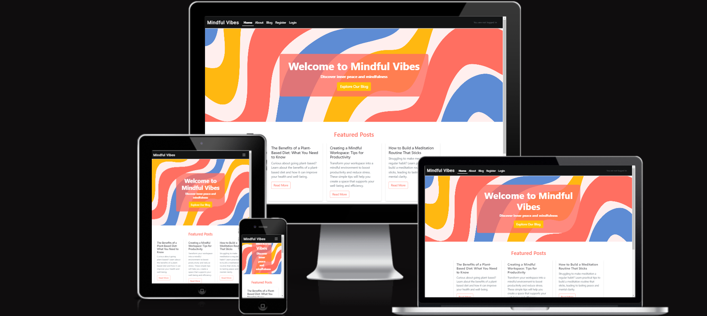

## User Experience - UX

[Back to the top](#top)

### User Stories

* As a website user, I can:
  - View a paginated list of blog posts to choose which post to read.
  - Click on a post to read the full text.
  - Create and register an account to comment on posts.
  - Access the About page to learn more about the site.

* As an authenticated website user, I can:
  - Comment on posts.
  - Like posts.
  - Modify or delete my comments.
  - View comments on individual posts.
  - Create new posts with fields such as title, slug, content, featured image, and excerpt.
  - Edit existing posts and update their content or other details like title, slug

* As a website superuser, I can:
   - Approve or disapprove comments, which are displayed along with the post and author in the admin dashboard.
   - Filter comments based on approval status and creation date.
   - Filter posts based on their status (draft or published) and approval status.
   - Edit and update the content of the About page using the Summernote editor for rich text formatting.
   - Create new posts with fields such as title, slug, content, featured image, and excerpt.
   - Edit existing posts and update their content or other details like title, slug, or approval status.
   - Delete posts as needed.
   - Search for posts by title or content.
   - Moderate comments by approving or disapproving them, allowing only appropriate content to be displayed.

### Agile Methodology

The Agile Methodology was used to plan this project, utilizing GitHub’s Project Board. You can view the project board [here](https://github.com/users/AnnieRho7/projects/2).

### The Scope

* To create a user-friendly, visually appealing wellness blog.
* To enable user interaction through commenting on posts.

## Design

The design of this project follows a clean and modern aesthetic to ensure a user-friendly and visually appealing experience. Below are the key design elements:

### Color Palette
The chosen color scheme reflects a calming and mindful vibe, aligning with the project's theme.

| **Color**           | **Hex Code** | **Usage**                                           |
|---------------------|--------------|-----------------------------------------------------|
| **Primary Color**    | `#FF6F61`    | Used for buttons, links, and other key elements      |
| **Secondary Color**  | `#ffc107`    | Accent color for hover effects and highlights        |

### Fonts
The site uses Google Fonts for a modern and consistent typography:

- **Primary Font:** Roboto (used for body text)
- **Secondary Font:** Lato (used for headings)

[Back to the top](#top)

## Wireframes

The wireframes below illustrate the initial layout and design for different sections of the website. These wireframes served as a blueprint during the development process to ensure a clean and user-friendly design.

### Desktop Wireframes

1. **Home Page**  
   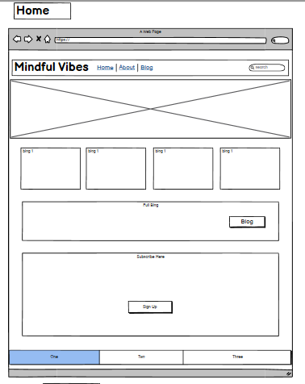

2. **About Page**  
   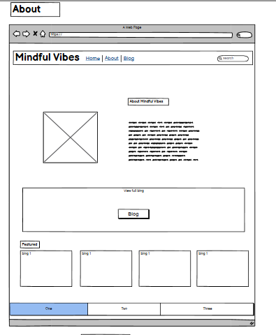

3. **Blog Page**  
   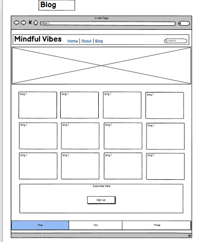

4. **Post Detail Page**  
   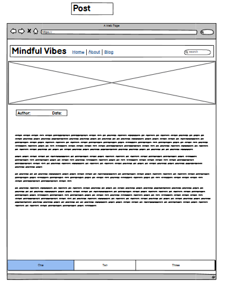

5. **Profile Page**  
   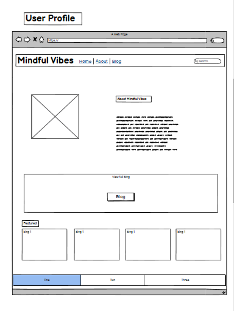

### Mobile Wireframe

1. **Mobile Layout**  
   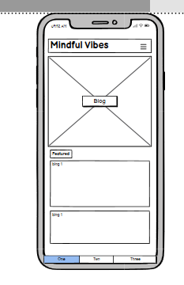

---

The wireframes helped in defining the layout and functionality of the site, ensuring a user-friendly experience.

## Entity-Relationship Diagram (ERD)

The Entity-Relationship Diagram below illustrates the database structure and relationships between different entities in our blog system. This ERD serves as a blueprint for our data model, ensuring efficient data management and clear relationships between various components of the system.

### ERD Diagram

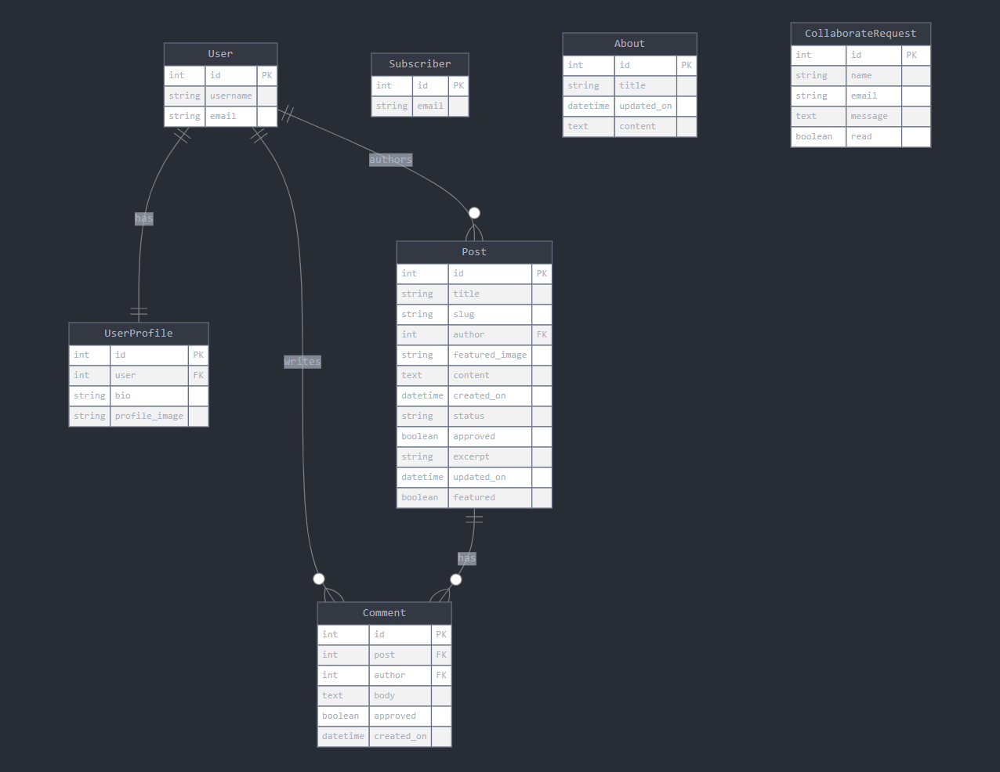

### Entity Descriptions

1. **User**
   - Represents registered users of the blog system.
   - Stores essential user information like username and email.
   - Forms the basis for user authentication and authorisation.

2. **UserProfile**
   - Extends the User entity with additional user-specific information.
   - Stores user bio and profile image.
   - Has a one-to-one relationship with User.

3. **Post**
   - Represents blog posts created by users.
   - Contains post content, metadata, and status information.
   - Linked to User and can have multiple Comments.

4. **Comment**
   - Represents user comments on blog posts.
   - Linked to both Post and User.
   - Includes comment body and approval status.

5. **Subscriber**
   - Stores information about newsletter subscribers.
   - Independent entity for managing mailing lists.

6. **About**
   - Represents the content for the About page.
   - Allows for easy updating of the About page content.

7. **CollaborateRequest**
   - Manages collaboration requests from users or visitors.
   - Stores request details.

### Relationships

- **User - UserProfile**: One-to-One relationship, extending user information.
- **User - Post**: One-to-Many relationship, where a user can author multiple posts.
- **User - Comment**: One-to-Many relationship, where a user can write multiple comments.
- **Post - Comment**: One-to-Many relationship, where a post can have multiple comments.

---

### Media

* All images used on the site are sourced from [Pexels](https://www.pexels.com/).
* Graphics were created in [Canva](https://www.canva.com/).

## Features

[Back to the top](#top)

### Homepage

* Displays the featured blog posts.
* Displays a hero image with a button that directs users to the blog.

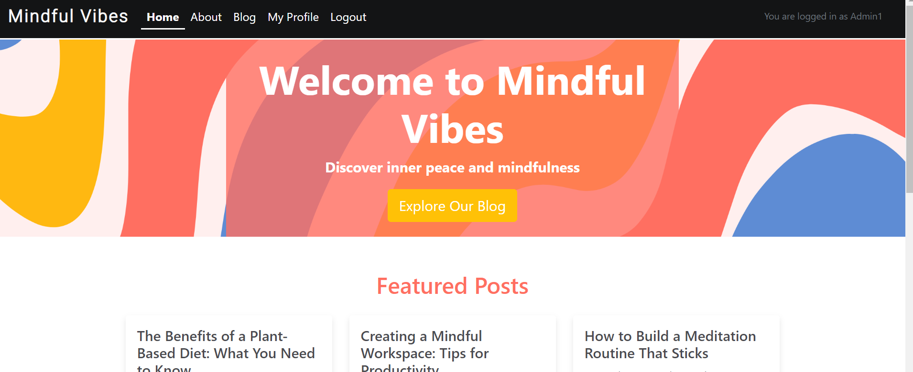

### Navigation Desktop

* The navigation bar at the top of each page is consistent and sticky, adapting based on user authentication and role.

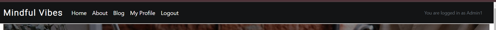

### Navigation Mobile

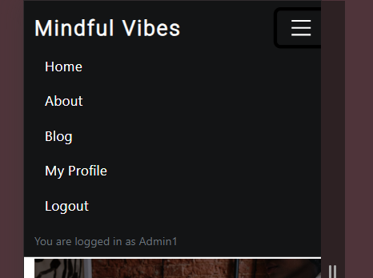

### Post Details

* Users can view and read individual posts. Authenticated users can also comment, which requires admin approval before display.

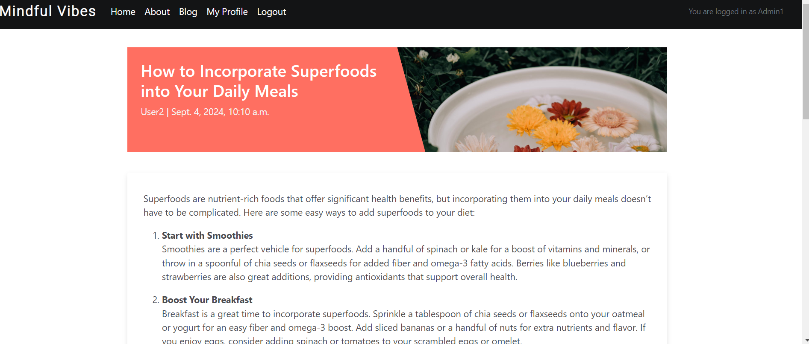

### All Posts

* Access all posts through a paginated view by clicking the blog button.
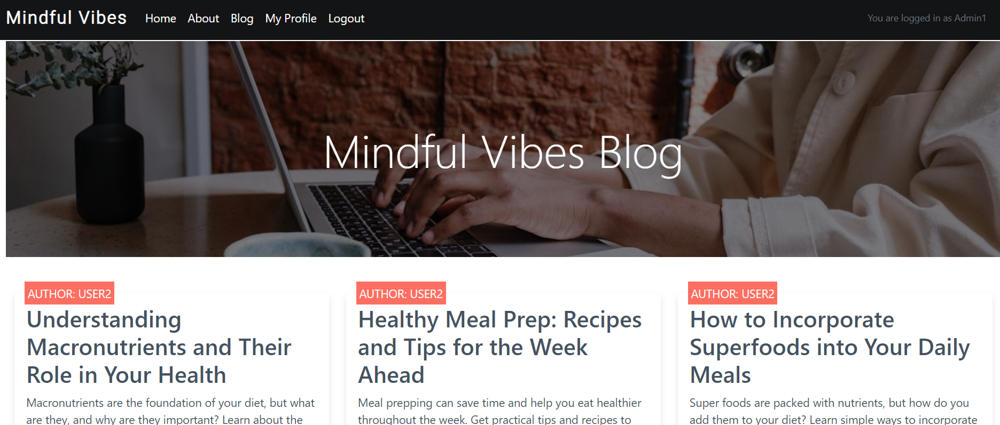

### Admin Backend

* Superusers manage posts and categories through the admin panel.

## Known Bugs and Limitations

During the development and testing phase, a few issues were identified. While these don't significantly impact the core functionality of the blog, they are documented here for transparency and future improvement.

### HTML Validation Error in Sign-Up Page

An unexpected open `` tag appears in the HTML of the sign-up page, causing a validation error. This tag is not present in the custom HTML but seems to be generated by Django's authentication system.

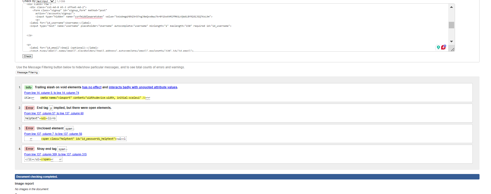
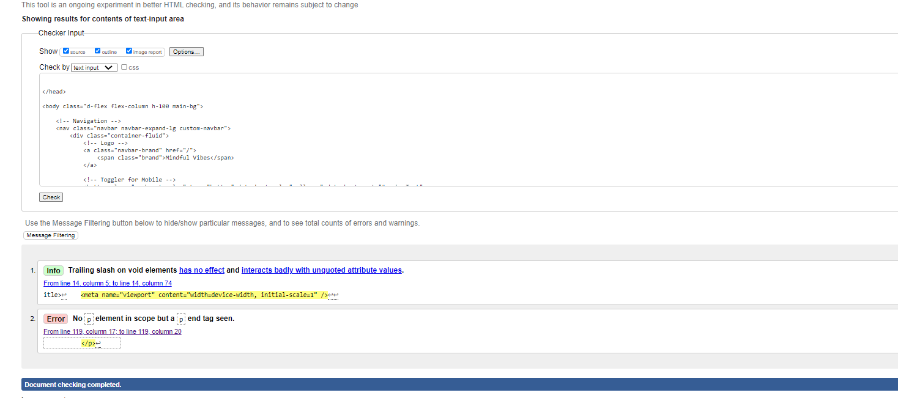

**Impact**: Low - Does not affect functionality but may impact perfect HTML validation scores.

### Post Deletion Redirect

When a user deletes a post from their profile, the page currently redirects back to `view_user_profile.html`. The intended behavior is to redirect to `user_profile.html`.

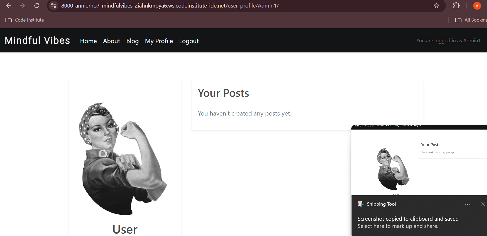

**Impact**: Low - Functionality works, but user experience could be improved.

### Blog Page Responsiveness

The blog page and text overlay have some responsive design limitations, particularly on smaller screen sizes. The text does not scale optimally with the screen size.

**Impact**: Medium - Affects user experience on mobile devices.

### CSS and Bootstrap Conflicts

There are some inconsistencies between custom CSS and Bootstrap styles, leading to difficulties in overriding certain Bootstrap defaults. This may result in some styling inconsistencies across the site.

**Impact**: Low to Medium - Mostly aesthetic issues, core functionality not affected.

---

These issues have been identified and documented for future iterations of the project. While they do not significantly impact the core functionality of the blog, addressing them would enhance the overall user experience and code quality.

### Possible Future Features

* User profile management and enhanced frontend admin functionality.
* Social login options for Facebook or Google.
* Password recovery options - Allow users to reset their passwords through email or SMS verification.
* Responsive design improvements - Enhance the mobile experience for better usability on different devices.

## Technologies

[Back to the top](#top)

### Languages Used

* [HTML 5](https://en.wikipedia.org/wiki/HTML/)
* [CSS 3](https://en.wikipedia.org/wiki/CSS)
* [JavaScript](https://www.javascript.com/)
* [Python](https://www.python.org/)
* [Django](https://www.djangoproject.com/)

### Django Packages Used

* [Gunicorn](https://gunicorn.org/) - WSGI server for running your Django application on Heroku.
* [Cloudinary](https://cloudinary.com/) - For hosting and managing static files and media.
* [dj-database-url](https://pypi.org/project/dj-database-url/) - Parses database URLs from Heroku environment variables.
* [psycopg2-binary](https://pypi.org/project/psycopg2-binary/) - PostgreSQL adapter for Python.
* [django-summernote](https://django-summernote.readthedocs.io/en/latest/) - WYSIWYG text editor for Django applications.
* [django-allauth](https://django-allauth.readthedocs.io/en/latest/installation.html) - Comprehensive authentication and account management.
* [django-crispy-forms](https://django-crispy-forms.readthedocs.io/en/latest/) - A Django app for beautiful forms styling.
* [whitenoise](http://whitenoise.evans.io/en/stable/) - Simplifies serving static files in production on Heroku.
* [django-extensions](https://django-extensions.readthedocs.io/en/latest/) - A collection of custom extensions for Django.
* [django-cloudinary-storage](https://github.com/cloudinary/django-cloudinary-storage) - Django storage backend for Cloudinary.
* [crispy-bootstrap5](https://github.com/django-crispy-forms/crispy-bootstrap5) - Bootstrap 5 template pack for crispy-forms.

### Frameworks - Libraries - Programs Used

* [Bootstrap](https://getbootstrap.com/)
* [JQuery](https://jquery.com/)
* [Git](https://git-scm.com/)
* [GitHub](https://github.com/)
* [Heroku](https://id.heroku.com)
* [VSCode](https://code.visualstudio.com/)
* [Fontawesome](https://fontawesome.com/)
* [Google Chrome Dev Tools](https://developer.chrome.com/docs/devtools/)

## Development & Testing

[Back to the top](#top)

### Manual Testing

For an overview of the manual tests conducted during the development of this project, please refer to the [Manual Testing Document](manual_testing.md).

### Validation Results

For detailed validation results, including screenshots from the HTML and PEP 8 validators, please refer to the following document:

- [Validation Screenshots](./validation-screenshots.md)

### Lighthouse Performance

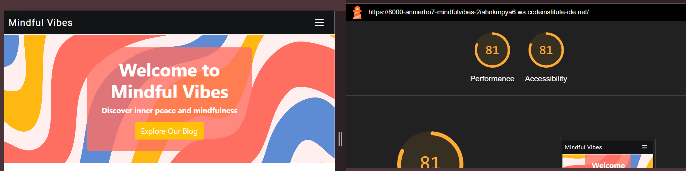

The blog achieved an accessibility score of 81 out of 100. While this score indicates good accessibility practices, there's room for improvement, particularly in the area of color contrast.

## Deployment

[Back to the top](#top)

### Heroku

The project was deployed via [Heroku](https://www.heroku.com/). The live link can be found [here](https://mindful-vibes-4dd2a43e1ec5.herokuapp.com/).

To deploy:
* Log in to Heroku and create a new app.
* Add PostgreSQL database and set environment variables.
* Configure static files with Cloudinary.
* Push code to Heroku and enable automatic deploys.

### Forking the GitHub repo

To fork the repository:
1. Log in to your GitHub account.
2. Navigate to the repository [here](https://github.com/AnnieRho7/mindful-vibes).
3. Click the 'Fork' button in the top right corner.

### Cloning the repo with GitPod

1. Log in to GitHub.
2. Navigate to the repository [here](https://github.com/AnnieRho7/mindful-vibes).
3. Click 'Code' and copy the URL.
4. Open a new workspace in GitPod and clone the repo.

### Download and extract the zip directly from GitHub

1. Log in to GitHub.
2. Navigate to the repository [here](https://github.com/AnnieRho7/mindful-vibes).
3. Select 'Download Zip' and extract it.

## Credits

[Back to the top](#top)

* The project was inspired by **Code Institute's** walkthroughs and tutorials.
* Blog content reflects my own knowledge and interests, enhanced with the help of **AI tools**.
* Images were sourced from [Pexels](https://pexels.com/).
* Acknowledgments to **Code Institute** students for their projects that influenced my work.
* Utilized **AI tools** like ChatGPT and Perplexity for content assistance.
* Various **YouTube tutorials**, particularly from **Codemy**, were helpful in the development process.

## Acknowledgments

Thanks to [Code Institute](https://codeinstitute.net) for their resources and guidance. Special thanks to my mentor, Marko, for their support and the resources they shared with me.
