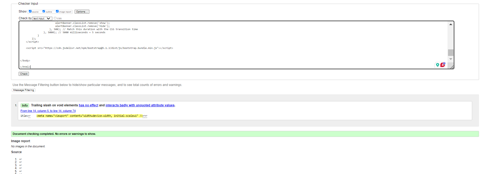

# Validation Screenshots

## HTML Validation Screenshots

### Home

### About

### Blog

### Profile

### Create Post

### Edit Post

### Subscribe

### 404 Error

### Log In

### Log Out

### Password Reset

### Password Reset Done

---

## CSS Validation
Here are the results from the W3C CSS Validator:

---

## PEP 8 Lint Validation

Here are the results from the PEP 8 lint validator for the Python files in the project:

### About App
- **URLs**
  
  
- **Views**
  
  
- **Models**
  
  
- **Forms**
  

### Blog App
- **URLs**
  
  
- **Views**
  
  
- **Models**
  
  
- **Forms**
  

### User App
- **URLs**
  
  
- **Views**
  
  
- **Models**
  
  
- **Forms**
  

### Project Settings
- **Settings**
  

### Project URLs
- **Project URLs**
  

